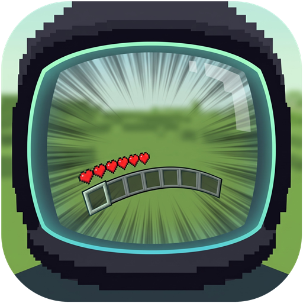

# There's a Visor On My Face

**TVOMF** for short. A client-side Fabric mod for Minecraft 26.2.

You have been playing Minecraft with your hearts, hotbar and minimap glued flat to the inside of
your eyeballs. That's weird. This mod puts them where they belong: on a visor, on a helmet, on
your face, and the visor moves when you do.

> **Standing on someone's shoulders:** the HUD sway at the heart of this mod comes from
> [GD656MotionHUD](https://modrinth.com/mod/gd656motionhud) by **Minecraft_GD656** (Forge 1.20.1,
> MIT). TVOMF began as a Fabric port of it and then kept going. It is unofficial and not supported
> by the original author; see [CREDITS.md](CREDITS.md) for exactly what is theirs and what is new.

## See it move

Just the sway: standing still and flicking the mouse hard from side to side.

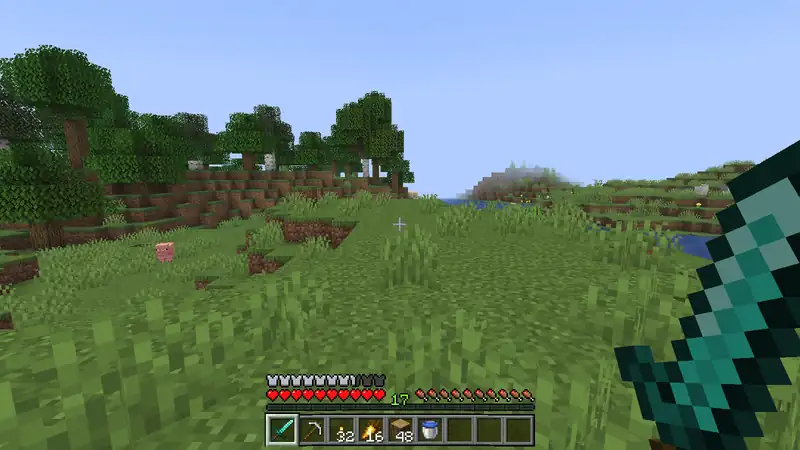

Everything at once on the vanilla HUD. Look right, snap left, jump, then sprint:

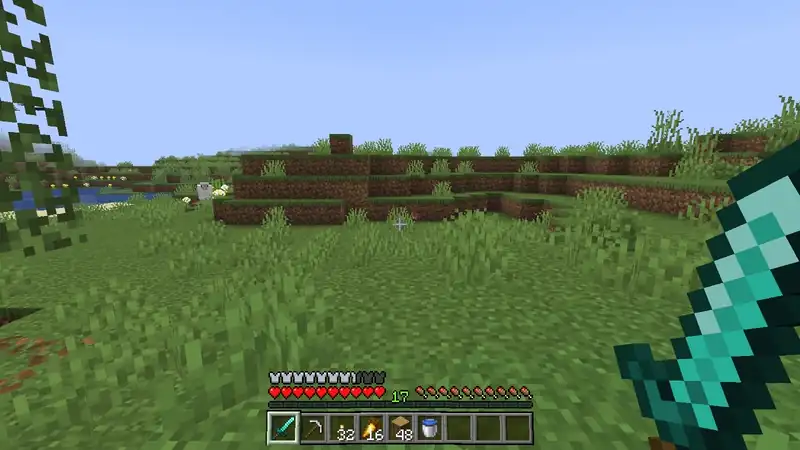

The same two takes with about fifty other mods loaded, including a minimap, block tooltips and a
paper doll, all riding the visor:

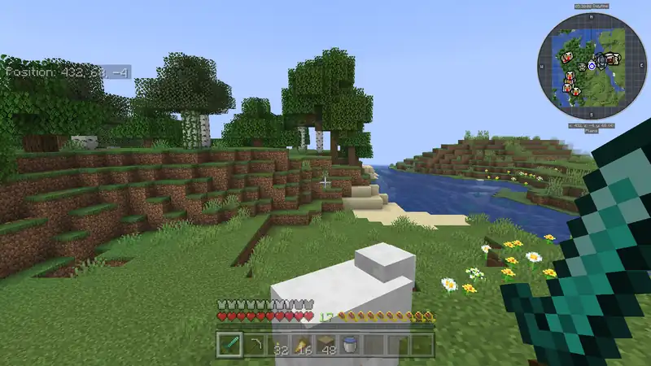

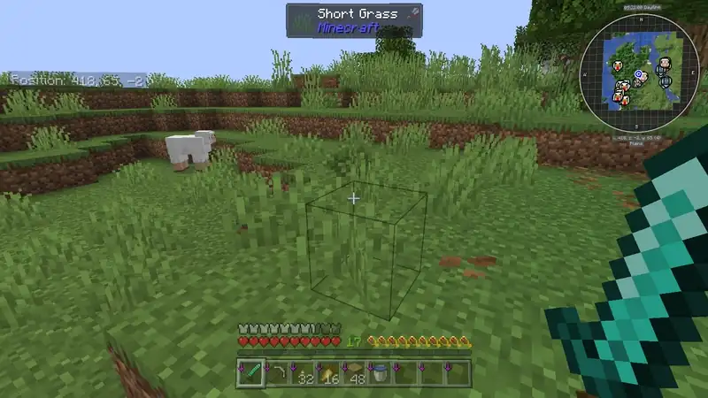

These were shot with the author's own settings, not the defaults: a stronger sway (`maxOffset`
44, `damping` 0.37, `sensitivity` 0.25, `motionSensitivity` 28) and a gentler curve (cylinder,
strength 9, rising to 18 with a 2.5% zoom-out while sprinting; bob 2 and 3.5).

## What the visor does

- **It sways.** Turn your head and the HUD lags behind for a moment, then catches up. This is the
  original GD656MotionHUD effect, Battlefield-style.
- **It reacts to jumping and falling.** Jump and the HUD dips; fall and it lifts.
- **It bobs.** Walk and it bobs in step with you. Sprint and it bobs harder.
- **It curves.** The HUD bends towards the middle of the screen like the inside of a visor. Pick a
  bowl (`sphere`) or a curved-monitor shape (`cylinder`).
- **It braces when you sprint.** The curve deepens and the whole HUD pulls in slightly, then
  relaxes when you stop. How much and how fast are up to you.
- **It lets you rearrange the furniture.** Every HUD element, vanilla or added by a mod through
  Fabric API, can be nudged on its own.
- **It takes other mods along.** Minimaps, tooltips, captions and paper dolls ride the visor too.

Everything is a toggle or a slider. If you only want the sway, turn the rest off and nobody will
judge you.

## Stills

Motion is the point, so stills undersell it, but here is the curve standing still.

| | Just this mod | With a full mod set |
|---|---|---|
| Author's settings (cylinder, strength 9) | 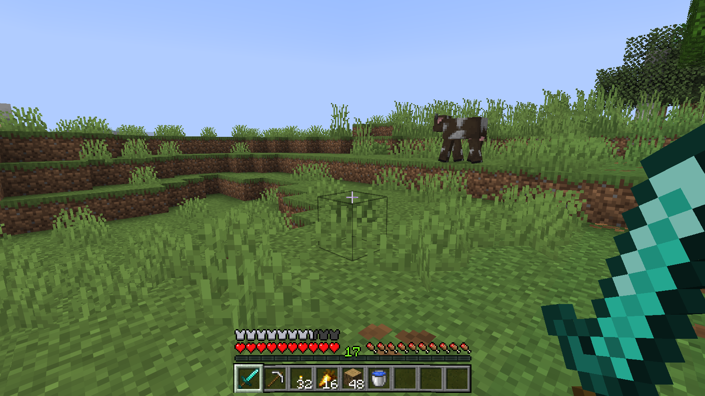 | 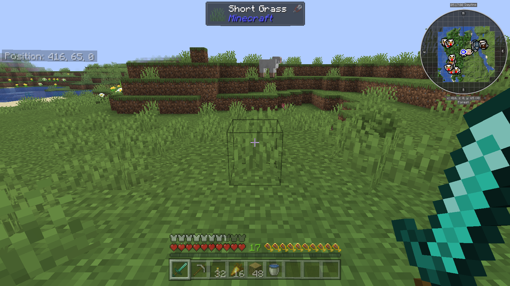 |
| Sphere, turned up to 70 | 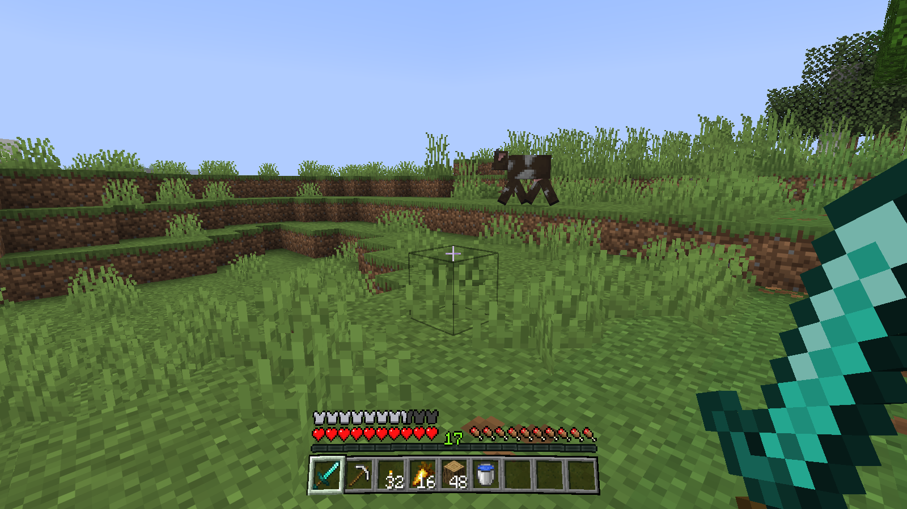 | 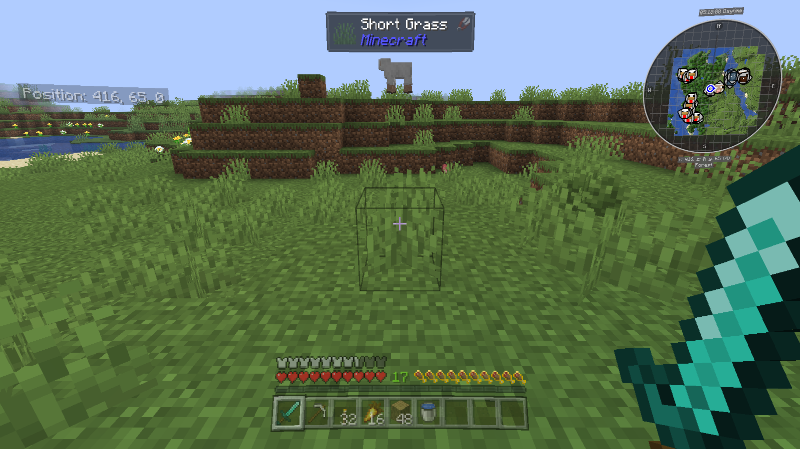 |
| Cylinder, turned up to 70 | 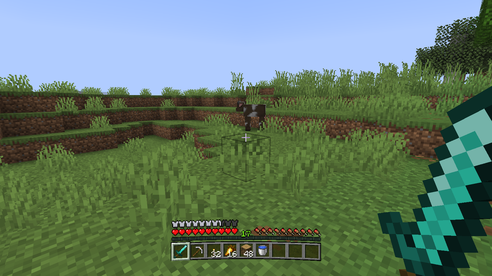 | 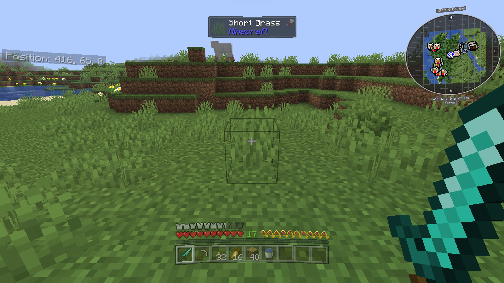 |
| Curve off, for comparison | 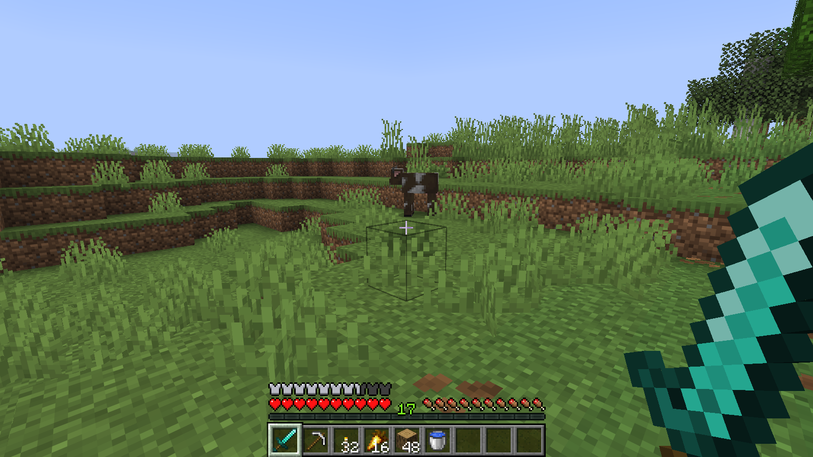 |  |
| Mid-turn | 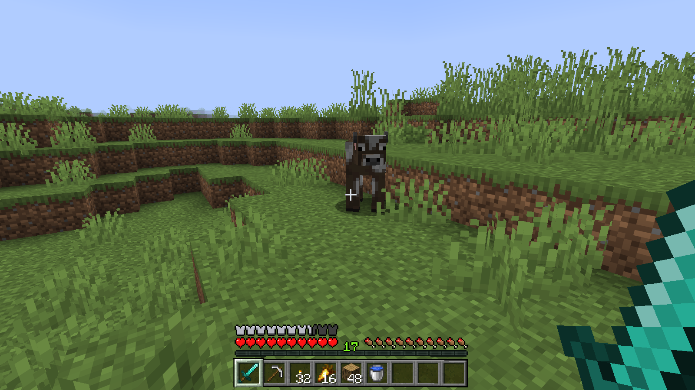 | 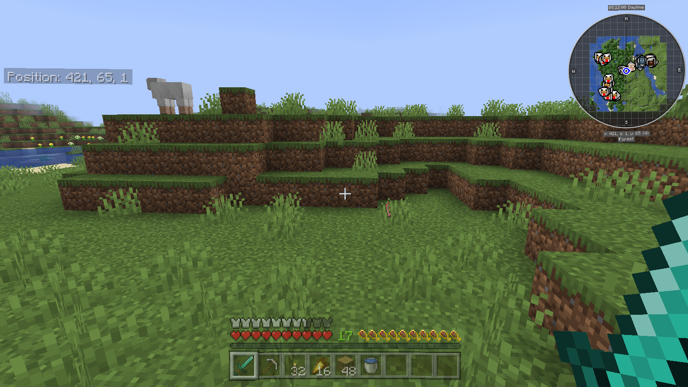 |
| Sprinting | 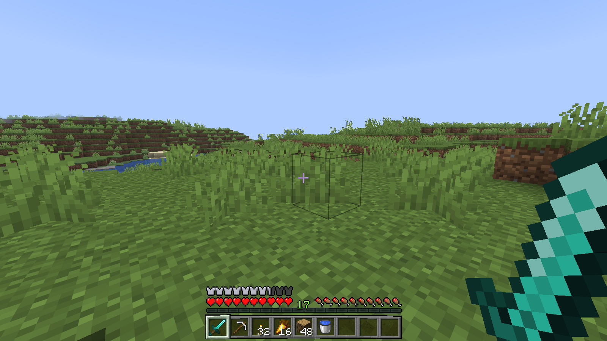 | 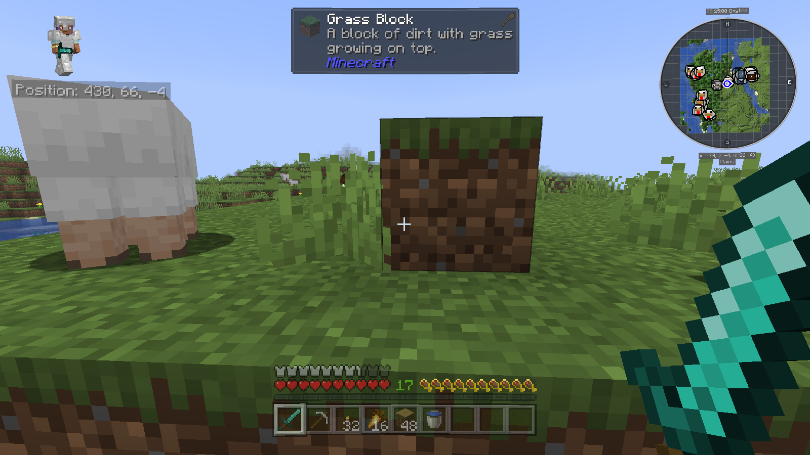 |

## What it leaves alone

- Full-screen overlays (vignette, pumpkin blur, spyglass, portal, sleep) never move. Your visor is
  not that dirty.
- Menus and inventories stay flat and still, so buttons are where your mouse thinks they are.
- The crosshair stays the same size, and can be told to stay put entirely.

## Installing

Needs [Fabric Loader](https://fabricmc.net/use/) and [Fabric API](https://modrinth.com/mod/fabric-api).
Drop the jar in your `mods` folder. It is client-side only and works on any server.

## Recommended alongside

A curved visor pulls things away from the screen edges, so you will probably want to move a few
of them back. TVOMF can offset each HUD element by itself, but a dedicated mod does it with a
nicer screen:

- **[Raised](https://modrinth.com/mod/raised)** (recommended): moves the hotbar, chat, boss bar,
  scoreboard, effects and more, and keeps the chat clickable where you put it. Its offsets and
  TVOMF's add together, so pick one mod per element.
- **[BedrockIfy](https://modrinth.com/mod/bedrockify)**: its screen safe area pushes the whole HUD
  in from the edges, and its paper doll rides the visor too.

Both are optional, and both have been run together with TVOMF.

## Settings screen

With [Mod Menu](https://modrinth.com/mod/modmenu) and [Cloth Config](https://modrinth.com/mod/cloth-config)
installed, the mod has a settings button in Mod Menu's mod list. Both are optional; without them
use the commands or the config file.

## Commands

All commands are client-side and work on any server.

| Command | Effect |
|---|---|
| `/tvomf config list` | Show the current settings |
| `/tvomf config edit <maxOffset\|damping\|sensitivity\|motionSensitivity\|curveStrength\|sprintCurveStrength\|sprintCurveTransition\|sprintZoom\|bobStrength\|sprintBobStrength> <value>` | Change a sway, curve or bob value |
| `/tvomf config bob <true\|false>` | Turn the walking bob on or off |
| `/tvomf config curve <true\|false>` | Turn the curved HUD on or off |
| `/tvomf config sprintcurve <true\|false>` | Whether the curve changes while sprinting |
| `/tvomf config reset` | Restore the sway values to their defaults |
| `/tvomf config sway <true\|false>` | Turn the sway on or off |
| `/tvomf config crosshair <true\|false>` | Whether the crosshair sways with the HUD |
| `/tvomf config reload` | Re-read the config file |
| `/tvomf element list` | List the movable HUD elements and their offsets |
| `/tvomf element move <id> <x> <y>` | Shift an element by GUI pixels |
| `/tvomf element percent <id> <x> <y>` | Shift an element by a percentage of the screen size |
| `/tvomf element reset <id>` | Put one element back |
| `/tvomf element resetall` | Put every element back |

Pixel and percent offsets add together, and both are measured from the element's normal position.
Positive x is right, positive y is down.

## Config

`config/tvomf.json`:

| Key | Default | Meaning |
|---|---|---|
| `swayEnabled` | `true` | Master switch for the sway |
| `maxOffset` | `25.0` | Largest sway distance, in GUI pixels (0-50) |
| `damping` | `0.25` | Fraction of the offset left after 50 ms; lower recentres faster (0.1-1.0) |
| `sensitivity` | `0.1` | GUI pixels of sway per degree of camera rotation (0.01-1.0) |
| `motionSensitivity` | `16.0` | GUI pixels of vertical sway per block the camera rises or drops, e.g. jumping and falling; 0 turns it off (0-100). Not in the original mod |
| `swayCrosshair` | `true` | Whether the crosshair sways |
| `curveEnabled` | `true` | Bends the HUD like a curved visor; flattens while a screen is open. Not in the original mod |
| `curveStrength` | `25.0` | Strength of the bend (0-100) |
| `curveShape` | `sphere` | `sphere` bends towards the centre in every direction; `cylinder` bends only sideways, like a curved monitor. Command: `/tvomf config shape <sphere\|cylinder>` |
| `sprintCurveEnabled` | `true` | Eases the bend to `sprintCurveStrength` while sprinting and back afterwards |
| `sprintCurveStrength` | `45.0` | Strength of the bend while sprinting (0-100) |
| `sprintCurveTransition` | `0.5` | Seconds the bend takes to change when sprinting starts or stops; 0 is instant (0-10) |
| `sprintZoom` | `4.0` | Percent the whole HUD shrinks towards the screen centre while sprinting; 0 turns it off (0-20). Works with the curve on or off |
| `bobEnabled` | `true` | The HUD bobs in step with the player's walk. Not in the original mod |
| `bobStrength` | `3.0` | Height of the bob while walking, in GUI pixels (0-20) |
| `sprintBobStrength` | `5.0` | Height of the bob while sprinting, in GUI pixels (0-20) |
| `elements` | `{}` | Per-element offsets, e.g. `"minecraft:hotbar": {"x": 0, "y": -10, "xPercent": 0, "yPercent": 0}` |

## Known limits

- Moving the chat does not move where it responds to clicks.
- The hotbar, health, armour, food, air and experience are separate elements; move each one.

## Building

```
gradlew build
```

The jar is written to `build/libs`.

## Visual test

`run-visual-test.ps1` starts a client, creates a world and writes to `build/run/clientGameTest`:

- `screenshots/`: the HUD flat and curved, at rest and with a fixed sway offset.
- `sway_trace.csv`: the sway offset frame by frame during a long fall; it should change smoothly.

To include another mod's HUD in the screenshots, copy its jar into `build/run/clientGameTest/mods`
first.

## Page media

`make-media.ps1 -ModSet solo` (or `full`) shoots the stills and the two five second clips in
`docs/media` from a scripted run in the test client: 1600x900, the same camera path every time.
Add `-SettingsFile path\to\tvomf.json` to shoot with your own settings instead of the defaults.
It needs ffmpeg on the PATH. For `full`, put the other mods' jars in
`build/run/clientGameTest/mods-full`.

## Credits and licence

MIT, same as the mod it is based on. The sway model, its three settings and the
`config list/edit/reset` commands come from GD656MotionHUD by Minecraft_GD656; the rest was written
for this project. Details are in [CREDITS.md](CREDITS.md) and [LICENSE](LICENSE).

Bugs in TVOMF are TVOMF's fault. Please report them here, not to the original author.
